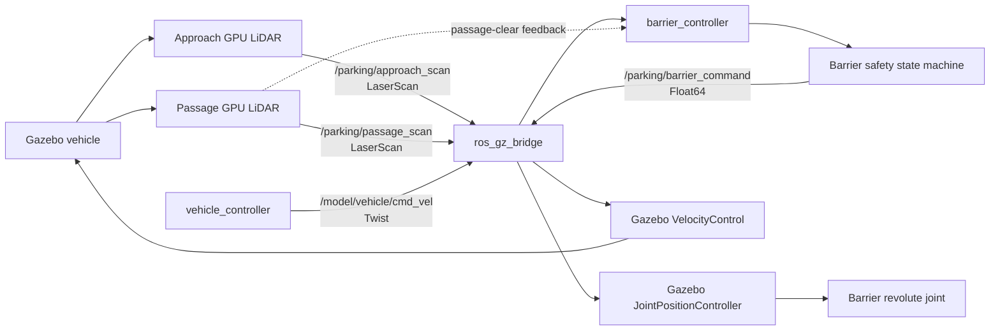

# Smart Parking Barrier — ROS 2 and Gazebo

A self-contained ROS 2 Jazzy and Gazebo Harmonic simulation of an automatic parking barrier. The project demonstrates a complete LiDAR-driven vehicle-entry cycle: a vehicle approaches, the barrier opens, a downstream sensor confirms passage, and the barrier closes after the lane is clear.

## Project overview

This IEEE RAS project combines real Gazebo GPU LiDAR measurements, ROS 2 message bridging, a safety-focused barrier state machine, and a Gazebo revolute-joint controller. All controller timing uses simulation time, making the demonstrated behavior repeatable.

## Problem statement and objectives

An automatic barrier must not open without detecting a vehicle or close while a vehicle is underneath it. This project detects a vehicle on approach, raises the boom, confirms passage with an independent sensor, and only lowers the boom after the lane is clear.

- Detect an approaching vehicle using Gazebo LiDAR.
- Command a physical Gazebo barrier joint through ROS 2.
- Prevent closure while the passage zone is occupied.
- Keep the package portable and reproducible in a standard ROS 2 Jazzy workspace.

## Features

- Two narrow, directional Gazebo `gpu_lidar` sensing zones.
- ROS 2 ↔ Gazebo bridging through `ros_gz_bridge`.
- Debounced, timeout-protected occupancy detection.
- Reopen-on-detection safety behavior during closing.
- Gazebo `JointPositionController` for the barrier and `VelocityControl` for the demonstration vehicle.
- GUI and headless launch modes.
- Five unit tests for state-machine safety and LiDAR debounce behavior.

## System architecture



## Technologies used

- Ubuntu 24.04 (native Linux or WSL2)
- ROS 2 Jazzy
- Gazebo Harmonic / Gazebo Sim 8
- `ros_gz_sim`, `ros_gz_bridge`, Python 3, and `rclpy`
- SDF 1.9, YAML, and ROS 2 launch files

## Directory structure

```text
smart_parking_barrier/
├── config/                     # Bridge map and controller parameters
├── docs/                       # Architecture notes
├── launch/                     # ROS 2 launch entry point
├── models/                     # Reusable Gazebo barrier and vehicle models
├── resource/                   # ament package resource marker
├── rviz/                       # Optional RViz configuration
├── smart_parking_barrier/      # Python nodes and state machine
├── test/                       # Five unit tests
├── urdf/                       # Barrier URDF/Xacro reference artifact
├── worlds/                     # Complete Gazebo SDF world
├── package.xml                 # ROS 2 package metadata
└── setup.py / setup.cfg        # ament_python installation configuration
```

## ROS 2 nodes and responsibilities

| ROS node name | Executable | Responsibility |
|---|---|---|
| `parking_bridge` | `ros_gz_bridge parameter_bridge` | Bridges Gazebo sensor, clock, command, and odometry messages. |
| `barrier_controller` | `barrier_controller` | Debounces LiDAR data, runs the safety state machine, and publishes the boom target angle. |
| `vehicle_controller` | `vehicle_controller` | Publishes the deterministic vehicle velocity command. |
| `simulation_monitor` | `simulation_monitor` | Reports a completed end-to-end state cycle. |

## ROS 2 topics and message types

| Topic | ROS type | Direction | Purpose |
|---|---|---|---|
| `/clock` | `rosgraph_msgs/msg/Clock` | Gazebo → ROS | Simulation time. |
| `/parking/approach_scan` | `sensor_msgs/msg/LaserScan` | Gazebo → ROS | Approach-zone detection. |
| `/parking/passage_scan` | `sensor_msgs/msg/LaserScan` | Gazebo → ROS | Downstream passage detection. |
| `/parking/barrier_command` | `std_msgs/msg/Float64` | ROS → Gazebo | Barrier joint target angle in radians. |
| `/parking/barrier_state` | `std_msgs/msg/String` | ROS | Current state-machine state. |
| `/parking/system_status` | `std_msgs/msg/String` | ROS | State-transition status. |
| `/model/vehicle/cmd_vel` | `geometry_msgs/msg/Twist` | ROS → Gazebo | Vehicle velocity command. |
| `/parking/vehicle_odom` | `nav_msgs/msg/Odometry` | Gazebo → ROS | Vehicle odometry for observation. |

## Sensor and control flow

The SDF world defines two fixed `gpu_lidar` sensors. The approach sensor publishes `/parking/approach_scan`; `barrier_controller` computes its minimum finite range, rejects stale data, and debounces occupancy. An occupied approach zone transitions the barrier from `CLOSED` to `OPENING`.

The controller publishes its requested angle to `/parking/barrier_command`. `ros_gz_bridge` converts the `std_msgs/msg/Float64` message to Gazebo `gz.msgs.Double`, which drives the world’s `JointPositionController` on `barrier_joint`.

The downstream sensor publishes `/parking/passage_scan`. Once the vehicle enters that zone, the state changes to `VEHICLE_PASSING`. The boom closes only after the passage scan has remained clear for `clearance_delay`. Any approach or passage detection while closing commands reopening.

## Barrier state-transition logic

```text
CLOSED --approach occupied--> OPENING --open angle reached--> OPEN
OPEN --passage occupied--> VEHICLE_PASSING --passage clear for delay--> CLOSING
CLOSING --closed angle reached--> CLOSED
```

- Passage detection prevents closure.
- New approach or passage detection during `CLOSING` returns to `OPENING`.
- Opening or closing timeouts transition to `FAULT`, which commands the safe open angle.

## Vehicle movement logic

The vehicle begins in the visible approach lane. `vehicle_controller` immediately publishes positive body-X velocity to `/model/vehicle/cmd_vel`; Gazebo `VelocityControl` moves it through both sensing zones. It is a deterministic LiDAR target, not a drivetrain model; wheel visuals are fixed to the chassis.

## Installation prerequisites

Install ROS 2 Jazzy and Gazebo Harmonic on Ubuntu 24.04. ROS-Gazebo integration is required:

```bash
sudo apt update
sudo apt install ros-jazzy-ros-gz
```

## Workspace setup and build

Clone or copy this package into `~/ras_smart_parking_ws/src`, then build:

```bash
source /opt/ros/jazzy/setup.bash
cd ~/ras_smart_parking_ws
colcon build --symlink-install --packages-select smart_parking_barrier
source install/setup.bash
```

## Run instructions

GUI launch:

```bash
source /opt/ros/jazzy/setup.bash
cd ~/ras_smart_parking_ws
source install/setup.bash
ros2 launch smart_parking_barrier smart_parking.launch.py gui:=true rviz:=false
```

The launch file uses the dedicated Gazebo transport partition
`smart_parking_barrier_demo` by default, preventing unrelated Gazebo sessions
from interfering with this simulation. Override it only when intentionally
connecting tools to a different partition: `gz_partition:=your_partition`.

## Headless execution

Headless launch is supported. Rendering remains enabled because Gazebo GPU LiDAR requires a rendering backend.

```bash
source /opt/ros/jazzy/setup.bash
cd ~/ras_smart_parking_ws
source install/setup.bash
ros2 launch smart_parking_barrier smart_parking.launch.py gui:=false rviz:=false
```

## Useful ROS 2 inspection commands

```bash
ros2 node list
ros2 topic list
ros2 topic echo /parking/approach_scan --once
ros2 topic echo /parking/passage_scan --once
ros2 topic echo /parking/barrier_state
ros2 topic echo /parking/barrier_command
```

## Testing instructions

```bash
source /opt/ros/jazzy/setup.bash
cd ~/ras_smart_parking_ws
colcon build --symlink-install --packages-select smart_parking_barrier
source install/setup.bash
colcon test --packages-select smart_parking_barrier --event-handlers console_direct+
colcon test-result --verbose
```

The package contains five unit tests: four state-machine safety tests and one occupancy-debounce test.

## Expected behavior

The vehicle moves toward the gate. The approach LiDAR detects it and opens the barrier. The passage LiDAR detects the vehicle after it clears the boom; when the passage zone remains clear for the configured delay, the barrier closes. `simulation_monitor` logs `SMART PARKING BARRIER TEST: COMPLETE CYCLE PASS` after observing the complete cycle.

## Known limitations and troubleshooting

- **WSL2 / WSLg graphics:** The GUI depends on WSLg and a working host graphics stack. A `currentGLContext`, EGL, or D3D12 message is an environment rendering issue, not evidence of a ROS package or control-logic failure. Use headless mode when GUI rendering is unavailable.
- **Headless renderer:** If the normal renderer fails, try software rendering: `LIBGL_ALWAYS_SOFTWARE=1 GALLIUM_DRIVER=llvmpipe ros2 launch smart_parking_barrier smart_parking.launch.py gui:=false rviz:=false`.
- **`ros2: command not found`:** Source `/opt/ros/jazzy/setup.bash`.
- **Package not found:** Rebuild, then source `install/setup.bash` in the same terminal.
- **No LiDAR data:** Check `gz topic -l`, then use `ros2 topic echo /parking/approach_scan --once`.
- **Barrier does not move:** Verify `/parking/barrier_command` and bridge topics with `ros2 topic list`.
- **Vehicle is no longer visible:** It continues downstream after passing the gate; restart the simulation to replay the demonstration.

## Future improvements

- Add vehicle speed control that waits for a confirmed open angle.
- Integrate parking-space occupancy and access authorization.
- Publish diagnostics and visualization markers for each sensing zone.
- Add launch tests for headless end-to-end simulation verification.

## Author / contributors

Prepared as an IEEE RAS Smart Parking Barrier project. Repository content is intentionally neutral and contains no personal machine paths or credentials.

See [Architecture](docs/ARCHITECTURE.md) for additional design rationale.
