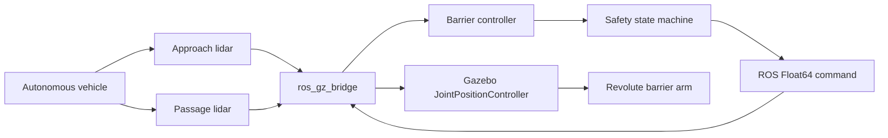

# Architecture

Two fixed Gazebo `gpu_lidar` sensors create independent occupancy zones. The controller only consumes their bridged `LaserScan` messages; it never reads vehicle model coordinates. It filters short range returns using a debounce period and rejects stale sensor data after `sensor_timeout`.

The arm is a physical child link connected to a fixed housing by a revolute joint. A Gazebo `JointPositionController` receives the bridged target angle. The test vehicle uses Gazebo's `VelocityControl` system and receives a bridged `Twist` command; it is a deterministic target for the lidar-based barrier demonstration.

Safety rule: an occupied passage zone prevents closure. If a scan detects either a new approach or a vehicle in the passage zone while closing, the controller reopens. Controller actuation timeouts transition to `FAULT`, whose target is open.

All nodes use `/clock`; no wall-clock sleep drives logic. The vehicle's initial delay and run duration use simulated time only.
